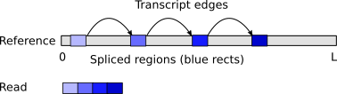
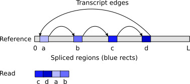
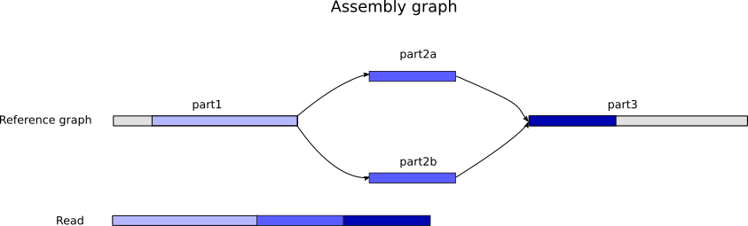

# raptor
Graph-based mapping of long sequences, noisy or HiFi

Master: [](https://travis-ci.com/isovic/raptor) Dev: [](https://travis-ci.com/isovic/raptor)

## Contents
- [Features and Overview](#features)
- [Work in progress](#wip)
- [Disclaimer](#disclaimer)
- [Building](#building)
  - [Building with BAM support (both input and output)](#building_with_bam)
  - [Building without the BAM support](#building_no_bam)
  - [Dependencies)](#dependencies)
- [Concrete examples on small test data](#concrete_examples)
  - [Demo 1 - Linear mapping and alignment (real example)](#concrete_examples_1)
  - [Demo 2 - Graph-based mapping of a plasmid reference onto a circular plasmid assembly (real example)](#concrete_examples_2)
  - [Demo 3 - Transcriptome mapping - linear and circular (circRNA) (synthetic example)](#concrete_examples_3)
  - [Demo 4 - Mapping to assembly graphs (synthetic example)](#concrete_examples_4)
- [Example usage](#example_usage)
- [Graph mapping](#graph_mapping)
- [Output formats](#output_formats)
- [Algorithmic overview](#algorithmic_overview)
- [License](#license)

## <a name="features"></a>Features and Overview
Raptor is a very versatile and fast **graph based sequence mapper/aligner** with a large number of features and more to come:
- Sequence-to-Graph mapping and path alignment.
- Linear sequence-to-sequence mapping/alignment when no graph is provided.
- Overlapping of sequences.
- Very fast mapping - on the order of magnitude of Minimap2, though somewhat slower.
- Minimizer indexing.
- Homopolymer suppression for mapping.
- Large number of input formats supported: `fasta`, `fastq`, `gfa1`, `gfa2`, `sam`, `bam`, `rdb` (RaptorDB), and `gzipped` versions of those. Also, PacBio `.xml`.
- A number of supported output formats: `paf`, `sam`, `bam`, `m4`, `mhap`, `gfa2`.
- Interchangeable aligners. For now: Edlib, KSW2; easy to add new ones.
- RaptorDB - a format similar to `.fai`, but supports an unlimited number of input files, in all supported formats listed above. Allows random access to any sequence or blocks of sequences (e.g. useful for overlapping on an HPC). Can be constructed via `raptor-reshape`.
- Can be used as a library. The Meson build is configured to produce a shared library automatically.
- Very large portions of code are covered with unit and Cram tests.

Note that it's potentially possible to also perform overlapping of sequences with graphs, but this hasn't yet been tested.

## <a name="wip"></a>Work in progress
Features:
- **Graph alignment**, to support alignment over small nucleotide variations. (Current graph mapping implementation is better suited for graphs with larger variations, such as assembly graphs, structural variations, transcriptomes, and similar).
- Mapping with inversions.
- RNA-seq/Isoseq mapping.
- Graph-based sequence simulator.

Thorough benchmarking is still on the to do list:
- Comparison with existing linear mappers.
- Comparison with existing graph-based mappers/aligners.
- Resource consumption.

## <a name="disclaimer"></a>Disclaimer
This is a proof-of-concept work in further rapid development of features.

Graph-based mapping in `raptor` is currently best suited for graphs representing large variations such as:
- Assembly graphs (e.g. `p_ctg` and `a_ctg` in Falcon)
- Haplotig graphs (e.g. from Falcon-Unzip)
- Reference graphs representing structural variations
- Circular genomes
- Transcriptomes
- (and similar)

At the moment, `raptor` does not yet align through small nucleotide variations (SNPs and short indels). **This feature is currently in development.**

## <a name="building"></a>Building
Raptor uses Meson as the build system, but the entire process is wrapped using Makefile to simplify the command line usage.

### <a name="building_with_bam"></a>Building with BAM support (both input and output)
This will compile `raptor` with support for BAM files, as well as the PacBio Dataset format (`.xml` files).
BAM support is useful, for example, to polish contig sequences using `arrow` (`raptor` will automatically parse and apply any PacBio specific tags/headers).
To build, simply type:  
```
make release-pb
```

To test the installation, run:
```
make unit
make cram
```
This option will require the `pbbam` library which is a relatively big dependency with more than a hundred source files. The `pbbam` in itself is already included as a subproject, but it also has several of it's own dependencies:
- Htslib - also wrapped with Meson's subprojects.
- Boost - wrapping is not posibble for this one, so it either requires manual setup (see `.travis.yml`) or a system dependency.

To compile without the `.bam`/`.xml` support, please read the next subsection.

### <a name="building_no_bam"></a>Building without the BAM support
To build without `pbbam`, type:
```
make release
```
This will still support `.sam` output.

### <a name="dependencies"></a>Dependencies
- Meson 0.48 (to install: `pip3 install meson`)
- C++14 (either GCC >= 6.4 or Clang >= 4.0)
- Optionally, if compiling with BAM support: Boost 1.67. `pbbam` and `htslib` are wrapped within the subprojects.

## <a name="concrete_examples"></a>Concrete examples on small test data
These example command lines can be copy/pasted into the terminal. The data is available in the repo, and is commonly used for Cram and unit tests.

### <a name="concrete_examples_1"></a>Demo 1 - Linear mapping and alignment (real example)
- Mapping without alignment:
```
$ raptor -r test-data/ecoli-small/ecoli-0-100000.fasta -q test-data/ecoli-small/single_long_read.fa -v 0
m141013_011508_sherri_c100709962550000001823135904221533_s1_p0/3820/0_24292	24292	317	24259	+	gi|545778205|gb|U00096.3|	100000	24806	47832	12337	23026	60	cm:i:1050	NM:i:-1	AS:i:12323	pi:i:0	pj:i:0	pn:i:1	ps:i:0	cg:Z:*
```
- Mapping with alignment:
```
$ raptor -r test-data/ecoli-small/ecoli-0-100000.fasta -q test-data/ecoli-small/single_long_read.fa --align -v 0
m141013_011508_sherri_c100709962550000001823135904221533_s1_p0/3820/0_24292	24292	314	24292	+	gi|545778205|gb|U00096.3|	100000	24804	47863	23978	23059	60	cm:i:22267	NM:i:2320	AS:i:22267	pi:i:0	pj:i:0	pn:i:1	ps:i:0	cg:Z:1=1I20=3I6=1D14=1I4=2I11=1I2=1I7=1I1=1I12=2I28=1I1=1I3=1I1=1I19=1X24=1I13=1I11=1I7=1I5=1D3=1I5=1I12=2I1=1I5=1I5=1D1=1I7=1I2=1D5=1I3=1I7=3I13=1I1=1I5=1D10=1D3=1I11=1I16=6I2=2I7=1I2=1D3=1I13=1I6=1I5=1I19=1I2=1D1=1D3=1I3=1I12=1I4=1I24=1I7=1D12=1I5=1I12=1I22=1X5=1D8=1D1=1D1=1D26=1D3=1I4=1I1=1I9=1I5=1D11=1D14=1I7=1X1I27=1D9=1I7=1X4=1I18=1D20=1I9=1X1D11=1D19=2I31=1I10=1I13=1I7=1I4=1D5=1I35=2I44=1I9=1I3=1D14=1I10=1I7=1I6=1I2=1I2=1I4=1D17=1I10=1I15=1X1=1D21=1D7=1I5=1X7=1I5=1D6=1I3=1D4=1I6=1I25=2I1=1I15=1D2=2I14=1I11=1D17=1I1=1I26=1D23=1D7=1I11=1D8=1I39=1D2=1I29=1D1=1D17=1D5=1D10=1I6=1I28=1D1=1D1=1I12=1D27=1I4=1I5=1D1=1D4=2D4=1I19=1I15=1D10=1I11=1D16=1D17=1I5=1I27=1I10=1I9=1I1=1D10=1X10=1I2=1I21=1D2=1D16=3I2=1I5=1D2=1I11=1D6=3I29=1X8=1I2=1I1=1I14=2I2=1I4=1I2=1D17=1X23=1X3=1I12=1I3=1X7=1I6=1D33=1D9=1I2=1D5=1I11=1D10=1I8=1D23=1D6=1I6=1I43=1I25=1I7=1I14=1I7=1I7=1I3=1I20=1I22=2I8=1I4=1I36=2D15=1I7=1I4=1I16=1I12=1D9=1D3=1I5=1D12=1D15=1I8=1I16=2I2=1I2=2I12=1I14=1I11=1I12=1I15=1I21=1D12=1I7=1I10=1D7=1I14=1I1=1I9=1I7=1D7=1X1I8=1I24=1I1=1I17=1I10=1I5=1I11=1I25=1D2=1D3=1D1=1I6=1X9=1D16=1I6=1I11=1I6=2I3=1I32=1X1D3=1D2=1D48=1I3=1D1=1D21=1D32=1I5=1I7=1I12=1D32=1I25=1D32=1I15=1D2=1D7=1I2=1I28=1I16=1D32=1I18=1I7=1I1=1D8=1I6=1X34=1I3=1I46=1I20=1D17=1I1=1I5=1D10=1D23=1D7=1X6=1D34=1I3=1I9=1D1=1I4=1D14=1I4=1I13=1I4=1D6=1I3=1D19=1D28=1I7=1I18=1I43=1D6=1I5=1I1=1D21=1D6=1D10=1D2=1I1=1I6=1X13=1I9=2I26=1I11=1I10=1I21=1I23=2I16=1X18=2I9=1D7=1I22=1I5=1D7=1I40=5I3=5I2=2I1=1I1=2I1=7I2=2I1=4I2=1I1=3I1=2I1=5I2=3I2=1I1=5I1=4I1=2I6=3I6=1I11=1I10=1D18=1D6=2I25=1D28=1I26=1I9=1D3=1I27=1D2=1I1=1D9=1I8=1D3=1I20=1D11=1D6=1I13=1D14=1I3=1D2=1I9=1X4=2I2=1I9=1I1=1I9=1I5=1I8=1X5=1I29=1I21=1I4=3I2=1I10=1D20=1I10=1I14=1I8=1D10=1I8=1D2=1I19=1D1=1D3=1D5=1X1I8=1X5=1D4=1I8=1I7=1I23=1I10=1I1=1I7=1X11=1I3=1I4=1I24=1D6=1I12=1I5=1I9=1I5=1I25=1X6=1I25=1I14=1I6=1I2=1I9=1I12=1I5=1I16=1D15=2D16=2D18=1X14=1D9=1D3=1I1=1I2=1I3=1D3=1I1=1X8=1I22=1D11=1I4=2I18=1I13=1I1=1I3=1X2=1X15=1I10=1D16=1I11=1D3=1I13=1D5=1I1=1I6=1I20=1I1=1D2=1I2=2D10=1I44=1I9=1I14=1I21=1D15=1X1I9=1I2=1I2=1D39=1D6=1I7=1I2=1X4=1D24=1I35=1I4=1D20=1X6=1I3=1I23=1D22=1I15=1D17=1D34=1I1=1D10=1I26=1I1=1I3=1D4=1I50=1D25=1I7=1X1I3=1I22=1D15=1X43=1D12=1I19=1I3=1X44=1I24=1I3=1I18=1I16=1I2=1D6=1I20=1D19=3I14=1D49=1X24=1I7=1I33=1I6=1I31=1I17=1I12=1I7=1I15=1I13=1I31=1I3=1D3=1D2=1I40=1D21=1I6=1D7=1D5=1D3=1I6=1D4=1D17=1I9=1I3=1I2=1I3=1I3=1I6=1D17=1I3=1I12=1D8=1I22=1D11=1I4=1I53=1D20=1I3=1X1I2=1I4=1D10=1D42=1D1=1D5=1D9=2I53=2I17=1D15=1I10=1I4=2I6=1X6=1I6=2I10=1I5=1D7=1D15=1I10=1I8=1I12=1D1=1X2=1I1=1I5=1I13=1I3=1I4=1D1=1I9=1I10=1I22=1D1=1I2=1D5=1D13=1D23=1X28=1D5=1I12=2I2=1I2=1X1=1X34=1D11=1I15=1I21=1I24=1D48=1D7=1I12=1D25=1I1=1I14=1I3=1I10=1X3=1I18=1D8=2I2=1X2=1D22=1I15=2D27=2I12=1D9=1I13=1I15=1I17=1I37=1D16=1D12=1D24=1I5=1D32=1I12=2I4=1D2=1I5=1X1I1=1D17=1D3=1D16=1I2=1I8=1I7=1I4=1I15=1D7=1I40=1I48=1I26=2I8=1I13=1I3=1D3=1D35=1I9=1X1I5=1I31=1I7=1D22=1I11=1I4=1D6=1I8=1D8=1X8=1D8=1I11=1I3=2I5=1D8=1I20=1I28=1I4=2I5=1I2=1I1=1I27=1D16=1I2=1X2=1I14=1I5=1D6=1D6=1X4=1I3=1I7=1I2=1X22=1D42=1I1=1I17=1I1=2I7=1I6=1I7=1D8=1I40=3I15=1I15=1I12=1D21=1I3=1I28=3I2=1I38=1D13=1D43=1I9=1D4=1D11=1I7=1D8=1X1D15=1I18=1D2=1D10=1I2=1I5=1D6=1D1=1D2=1D25=1I18=1I1=1I2=1I36=1D35=1I5=1I3=1I3=1I4=1I15=1D28=1I25=1I8=1D7=1I8=1I8=1I16=2I16=1X7=1I19=1D18=1X8=1I24=1I14=1I8=1D8=1I18=1I14=1I15=1D2=1I8=1I7=1I33=1D6=1I15=1I40=1I12=1D24=1I2=1I5=1D38=1I4=1I16=1I2=1D11=1D28=1I79=1D8=1I4=1I5=1D30=1I22=1I1=1D10=1I2=1I5=1D26=1X3=1D16=1I5=1I9=1D4=1I32=1D3=1I3=1X2=1D3=1D3=1D4=1I11=1X5=1I3=1I1=1I1=1I18=1I23=1D2=1D5=1I7=1I21=1X10=1I30=1D2=1D7=1D12=1D6=1I7=1D6=1I21=1X4=1D6=2I5=1I17=2I5=1I29=2I15=1X26=1I7=1D9=1I3=1D7=1I18=1I4=2D8=1I2=1I1=1I3=1X3=1I1=1I10=1I20=1I1=1I5=1I25=1I23=1I5=1D3=1D4=1D8=1X2=1I4=1I6=1I46=1X5=1X2=1I6=1I7=1X6=1I16=1X4=1I13=1I3=1I16=1I19=1I12=1D3=1D3=1I2=1I14=1D1=1I10=1D32=1I18=1I4=1D7=1D6=1X3=1I1=1I1=1D10=1I1=1I1=1D5=1I2=1I15=1D2=1D6=1X1=1I19=1I7=4I1=2I1=5I2=1X2=2X2=4I1=3I4=1I7=2D2=1D6=1D2=1X6=1I25=1I5=1D14=1D2=1X3=1I6=1I10=1D15=4I42=1D13=1I37=1I2=1D47=2D6=1I11=1I4=1I14=1X8=1D5=1I5=1I20=2I13=1I7=1X14=1D13=1D4=1I9=1X8=1X1I14=2I8=2I9=1I7=1I4=1I6=1I15=1I32=1D15=1I3=1D2=1X2=1I9=1D5=1I12=1D5=1I7=1I7=1I11=1I25=1D5=1D3=1I1=1I17=1D10=1I7=1D6=1I2=1I15=1I1=1I10=1D19=1I39=1X2=3I2=1I3=1I28=1D4=1I29=1I11=1I1=1I14=1X3=1I2=1I5=1D4=1I2=1D16=1I2=1D7=1I15=1I9=1I5=1D3=1I15=1D23=1I5=1I5=1D2=1D5=1D4=1I42=1D21=1I1=1I20=1D8=1I5=1D11=1I1=1I4=1D1=1I6=1I2=1I1=1I10=1I8=1I3=1I2=2I1=1I8=1D4=1I8=1D34=1I9=1I3=1I8=1I1=1I6=1D4=1I21=1X5=1I5=1I16=1D11=1I3=1X3=1X4=1I10=1I20=1D8=1I21=2I7=1I20=1I10=1I25=1I15=1I5=1I15=1I44=1D58=1I22=1D33=1I5=1I5=1D2=1D18=1I8=1X7=1I12=1D19=2I18=1I4=1I16=1X33=1D23=1I10=1D3=1I3=1D8=1D14=1I15=1I7=1D21=1X1I10=1D28=1I2=1D8=1D41=1D7=1D8=1I2=1X24=1I13=1D1=1D7=1D12=1X21=1I25=1D8=1I17=1I4=1D16=1I12=1I6=1D14=1D1=1D4=1X2=1I21=1D3=1I110=1I8=1X8=1X8=1D23=1I14=1X2=1I18=1D2=3I20=1D2=1I4=1D19=1X1=1I9=1D3=1D57=1I7=1I4=1D31=1I6=1D15=1D4=1X5=1I14=1I19=1D8=2I8=1I3=1I25=1I4=1D37=1I3=2I28=1I1=1I6=1I6=1I3=1X2=1D40=2I1=1X15=1D11=1D30=1I5=1I12=2I7=1D9=1D14=1I13=1I1=2I4=1D10=1I3=1D8=1D3=1I8=1I10=1I10=1I25=1I3=1I4=1I5=1I10=1I5=1I8=1D1=1X7=1D14=1D4=1I17=1I25=2I23=2D6=1D5=1D4=1D11=1I14=1D2=1I5=1D3=1X16=1I16=1D5=1I23=1X14=1D2=1I13=1I45=1I19=1X20=1I2=6I3=1I8=1I12=2I5=1I2=1D7=1D1=1D3=1D8=1I2=1I30=1I28=1D15=1I4=1I12=1I51=1I4=1D1=1X9=1I30=1I39=1D2=1D2=1I46=1I2=1I6=1I20=1I10=1D7=1I15=1D10=1D16=1I1=1X26=1X19=1D18=1D1=1D14=1I3=1D6=1I4=1I4=1I8=1X8=1I3=3I2=1I7=1I4=1I12=1I2=1I13=1I9=1I8=2I16=1I6=1I2=4I12=1D9=1D8=1I2=1I1=1I5=2I3=2I5=1I14=1X18=1I6=1I26=1I2=1D19=1D1=1X18=1D22=1I5=1D14=1X20=1D42=1D4=1D11=1X1=1D4=1I9=2D4=1I12=1I13=1D4=1I8=1I8=2I5=1I8=1D18=1X1I2=1D3=1I2=1I15=1I7=1I14=1X9=1I2=1X13=1I16=1X3=1D9=1D9=1I10=1I18=1I14=1X10=1D2=1I23=1I1=1I9=1I2=1I6=1I13=2I11=1I6=1X12=1I16=1I26=1I17=1I20=1D12=1I12=1I8=1I10=1I13=1I11=1I1=1X16=1I1=2I2=1I5=1X9=1I2=1I54=1I8=1I4=1I20=1D14=1X2=1I12=2I3=1I7=1D9=3I2=1I7=2I8=1D15=1D6=1D18=1X1=1I40=1I2=1I1=1I14=1I15=1I9=1I14=1I7=1I5=1I4=1I1=1D30=1D5=1I4=1D1=1X3=1I1=1I10=1I22=1D6=1I20=1I2=1I29=1X4=1D7=1D3=1D3=1I5=1D4=1I18=2D6=1I34=1D2=2D10=1D20=1I5=1I20=1D10=1I5=1I3=1D15=1D40=1D1=1D2=1I5=1I12=1I12=1X1=1X1I25=1D7=1D12=1I7=1I23=1I27=1D4=1I27=1D20=1I1=1D10=1X2=1D3=1I8=1X8=1I21=1I1=1I3=1D11=2I17=1I14=1D4=1D10=1I3=1I8=1I4=1I16=1I2=1I13=1I26=2I3=1I8=1I3=1X11=1D9=2I30=1I2=1I18=1I13=1I14=1I5=3I4=1X1I26=2I12=1X12=1D11=1I2=1I13=1I6=1I1=2I10=1D9=1I13=1I4=1D14=1D33=1D12=1I23=1D6=1I10=1X1=1I19=1I2=1I13=1I7=1D4=1I28=1D6=1D24=1I3=1D3=1D16=1I2=1I30=2I4=1D13=1I11=1I2=1I10=1D3=1I3=1I17=2I6=1I14=1I2=1I1=1I11=1D9=1I36=1I8=1I3=1I5=1I9=3I14=1I4=1D7=1I6=1I7=2I28=1D4=1D4=1X7=1D19=1D1=1D6=1X10=1I9=2I8=1D25=1D8=1D10=1D9=1X19=1I3=1I45=1I1=1I9=1I7=1I12=1I2=1I19=1I31=1I14=1X14=1X12=1D3=1I19=1I20=1D9=1D21=1I12=1I17=1I9=1I2=1D2=1D8=1X1D34=1I15=1D13=1I7=1I14=1I6=1D21=1I17=1I8=1I18=1I1=1I3=1I11=2I12=1D3=1D8=1I15=2I10=3I2=1I15=1I24=1X1=1I26=1I28=2I7=1D10=1X2=1I36=1D2=1I14=1I4=2I1=1I16=1D4=1I18=1I19=1I2=1D14=1X3=1I8=1I6=1I29=1I11=1I20=1D7=1I7=1I26=1I6=1I3=1D23=1D6=1I40=1D26=1I6=1X31=1D10=1I13=1X12=1I38=1I8=2D5=1I7=1D3=1I26=1D11=1X3=1D8=1I1=1I9=1D5=1I52=1X6=1I13=2I17=1D3=1I7=1I8=1D5=1D7=1I18=1D1=1I7=2D8=1D4=1D16=1I15=1I17=1I4=1I4=1D8=1I15=1I20=1D5=1I7=1I2=1I3=1I7=1D10=1D3=1I4=1I7=1D8=2I7=1I6=1D12=3I10=1I28=1I4=1D6=1D15=1D8=1I15=1D17=2I9=1I5=1I2=1D10=1D21=1I14=1D6=1I7=1I6=1I10=1I3=1I5=1X19=1I18=2I7=2I12=1I1=1I18=1D2=1D3=1I1=1I11=1D4=1I5=1D17=1D16=1I8=1I17=1I5=1I4=1I3=1I5=1D5=1D11=1I3=1I14=1D5=1I5=1D9=1I16=1D3=1D9=2I7=1I26=1I9=1I7=1I27=1I4=1D8=1D19=1D24=1D17=1I5=1D1=1D2=1I12=1D18=1X8=1I10=1X4I10=2I12=1D10=1I10=1D7=1I15=1I27=1I25=1X1I1=1I11=1D8=1D7=1D1=1X6=1I5=2I13=1I27=1I10=1D7=1I48=1I12=1D16=1I1=1I4=2I4=1I8=1I15=1I9=1X12=1D21=1I10=1X15=1I4=1D19=1D3=1I13=1I13=1D2=1D40=1I16=1I2=1I3=2I10=1D25=2D16=1X13=1I8=1X1I5=1I6=1I11=1I7=1I8=2I3=1X2=1X30=1I4=1D2=1D4=1D20=1I25=1D16=1I19=1I18=1I6=1I9=1I8=1I4=1I6=1X26=1I4=1I13=1D1=1D13=1X25=1I2=1D24=1D5=2I11=1X5=1I5=1D2=1D4=1X17=1I8=1I4=1I5=1D11=1I5=1I5=1I9=1I16=1X18=1I67=1I1=1I5=1I15=1I10=1I8=1I1=1I25=1D3=1I26=1I4=1I36=1I8=1D21=1D8=1D2=1D9=1I3=1I7=1I3=1I16=1I2=1I10=1D12=1D19=1I11=1I14=1X8=1X18=1I12=4I29=1I24=1I10=1D22=1D24=1D7=1X4=1I11=1I4=1D15=1I26=1X17=1I23=1I64=1I7=1D34=1D15=1I10=1I11=2I2=1I2=1I9=1D2=1I34=1I14=1I17=1I5=1I19=1I5=1I5=1I6=1D6=1X1=1I4=1I6=1D3=1X5=1I3=1D2=1D8=1I8=1I8=1I5=2I7=1I7=1D22=1I11=1I7=1D15=1X3=1D4=1I2=1I35=1I3=1I15=1I6=1D5=2I7=1I29=1D21=1D15=1I14=1I1=1I17=1I11=1I16=1I3=1I22=1D13=1X30=1I6=1I6=1X25=1I1=1I31=1D48=1X6=1X2=1I3=1I4=1I1=2I5=1D5=2I16=1X4=1I8=1D33=1D6=1I14=1I2=1I14=1I21=1I8=1I2=1I11=1D4=1D8=1I5=1D22=1I11=1D6=1I16=1I3=1D8=1X5=1X14=1I8=2D4=1I12=1D11=1I5=1D3=1I19=1I8=1I4=1D2=1D12=1D6=1I3=1I2=1X8=1D5=1I12=1I15=1D26=3I4=1D5=2D24=1I1=2I1=1I1=1I11=1I7=1D7=1I10=1I4=1X33=1X1I2=61I1=1I1=3I1=3I2=3I8=1D5=1D12=1I5=1I16=1I14=1D6=2I3=1I4=1D8=1D5=2I1=1I1=1I3=1I24=1D4=1I2=2X2=1I7=1I8=1I20=1I27=1I5=1I1=1I8=1I11=1X15=1X28=1I10=1I20=1X3=1D11=1X4=1D19=1D6=1I31=1D4=1I15=1X4=1D7=1I10=1X25=2I10=1D6=1I5=1I16=2I2=1D15=1I6=1I14=1I18=1D11=1I39=1I2=1I43=1X32=2I11=1I15=2I14=1I38=1I8=1I22=1X15=1I35=1I1=1I8=1I9=1I3=1I2=1I2=1I2=1I24=1D7=1I4=1I13=1I6=1I21=1D15=1I9=1I8=
```

### <a name="concrete_examples_2"></a>Demo 2 - Graph-based mapping of a plasmid reference onto a circular plasmid assembly (real example)
This dataset is based on a real assembly of a plasmid genome. The Falcon assembler can construct a GFA-2 file of contigs, which will include circular edges in case the assembly was circular.

In this example, the assembly and the `contig.gfa2` is used as the target, and the reference genome as the "query" so that it can be aligned across the graph.


- Mapping without alignment:
```
$ raptor -r test-data/graph-mapping/real-1-plasmid/asm.plasmids.fa -g test-data/graph-mapping/real-1-plasmid/contig.s2.gfa2 -q test-data/graph-mapping/real-1-plasmid/ref.plasmids.fa -v 0
gi|386611788|ref|NC_017637.1|	102536	17	12592	-	ctg.s2.000000F	102273	1	12554	12528	12553	46	cm:i:927	NM:i:-1	AS:i:12526	pi:i:0	pj:i:0	pn:i:2	ps:i:1	cg:Z:*
gi|386611788|ref|NC_017637.1|	102536	12609	102536	-	ctg.s2.000000F	102273	12571	102257	89158	89686	46	cm:i:6549	NM:i:-1	AS:i:89120	pi:i:0	pj:i:1	pn:i:2	ps:i:1	cg:Z:*
gi|386607294|ref|NC_017636.1|	5360	0	3943	+	1	5332	1372	5301	3888	3929	60	cm:i:287	NM:i:-1	AS:i:3887	pi:i:0	pj:i:0	pn:i:2	ps:i:1	cg:Z:*
gi|386607294|ref|NC_017636.1|	5360	3988	5346	+	1	5332	3	1358	1365	1355	60	cm:i:101	NM:i:-1	AS:i:1364	pi:i:0	pj:i:1	pn:i:2	ps:i:1	cg:Z:*
```
- Mapping with alignment:
```
$ raptor -r test-data/graph-mapping/real-1-plasmid/asm.plasmids.fa -g test-data/graph-mapping/real-1-plasmid/contig.s2.gfa2 -q test-data/graph-mapping/real-1-plasmid/ref.plasmids.fa --align -v 0
gi|386611788|ref|NC_017637.1|	102536	0	12593	-	ctg.s2.000000F	102273	0	12571	12593	12571	60	cm:i:12567	NM:i:30	AS:i:12567	pi:i:0	pj:i:0	pn:i:2	ps:i:1	cg:Z:381=1D918=2I154=1I199=1I91=1I577=1I344=1I230=1D87=2D178=1I456=1I439=1I111=1I1901=1I277=1I90=1I162=1I207=1I221=1I59=1I1704=1I217=1I501=1I1518=1I567=1I184=1I195=1I349=1I250=
gi|386611788|ref|NC_017637.1|	102536	12593	102536	-	ctg.s2.000000F	102273	12571	102273	89943	89702	60	cm:i:89649	NM:i:338	AS:i:89649	pi:i:0	pj:i:1	pn:i:2	ps:i:1	cg:Z:168=1I1918=1D226=1I119=1I170=1I2710=1I17=1I3303=3I755=1I699=1I99=1I2468=1I1780=1I703=1I1735=1I209=1I100=1I23=1I5=1I2=2I345=1I69=1I118=1I1=1I1=1I333=1I329=1D75=1I45=1I30=1I74=1D268=1I185=1I2=1I1=3I1=1D106=1I65=1I236=1I206=1I82=1I134=1I85=1I34=1I91=1I11=1X246=1I223=1I78=1I1=1I581=1I25=1I221=1I149=1I380=1I61=1I189=1I1=1I275=1I2=1I19=1I28=1I28=1I54=2I187=1I85=1I210=2I67=1I36=1I54=1I157=1I9=1D254=1I1=1D16=1I431=1I114=1D408=1I77=1I73=1I982=1I230=1I680=1I40=1I148=1I215=1I160=1I233=1I55=1I58=1I55=1I766=1I76=1I318=1I118=1I112=1I6=1I85=1I15=1D8=1X1056=1I367=1I29=1I670=1I61=1I1=1I141=1I389=1I76=1D701=1I2=1I571=1I106=1I597=2I193=1D51=1I1612=1I338=1X134=1I154=1I634=1D347=1D1=2D1X3=1I464=1I83=1I21=2I2=1I160=1D215=1X21=1I41=1D15=1I206=1I35=1I4=1D271=1I51=1I512=1I416=1I315=1I18=1X274=1I209=1I194=1I293=1I32=1I12=1I611=1I241=1I189=1I712=1I711=1I219=1I171=1I303=1I21=2D305=1I304=1D1346=1I519=1I545=1I138=1I2977=1I31=1I867=1I2=2I26=1I40=1I207=1D1=1D19=1I10=1I76=1I981=1I20=2I1270=1I83=1I49=1D61=1I51=1I59=1I312=1I130=1I92=1I297=1I274=1I369=1D405=1I205=1I1X1281=1I1028=1I1307=1I16=1D216=1I187=1I2=1I85=1I207=1I1720=1I199=1I906=1I235=1I7=1I46=1I101=1I123=1I93=1I2=1I99=1I87=1I487=1I257=1I104=1I201=1I347=1D27=1I126=1I1857=1I1=1I2254=1I85=1I454=1I183=1I830=1I1=1I505=1I143=2I181=1I762=1I244=1I63=1I152=1I132=1D81=1I118=1I47=1I213=1I403=1I332=1D273=1I2766=1I1=1I479=1X113=2I139=1I37=1I547=1D367=1I444=1D448=1I9=1I63=1I86=2I32=1I1025=1I1007=1D554=1I12=1I323=1I265=1I127=1I566=1I217=1I27=1I556=1D197=1D66=1I117=1I94=1I82=1D60=1I119=1I177=1I124=1I352=1I3=1I11=1I221=1I2=1D98=1I182=1I79=1I200=1I183=1I2=1I177=2I126=2I110=1I90=1I14=1I4=1D23=1D53=1I6=1I29=1D1=1X49=1D4=1I34=1I113=1D39=1I94=1D111=1I14=1I40=1I9=1D63=1I79=1I2=1I66=1D172=1I12=1D39=1I16=1I44=1I22=2I22=
gi|386607294|ref|NC_017636.1|	5360	0	3985	+	1	5332	1372	5332	3985	3960	60	cm:i:3957	NM:i:31	AS:i:3957	pi:i:0	pj:i:0	pn:i:2	ps:i:1	cg:Z:379=1I538=1I186=1D15=1I251=1I44=1D10=1D173=1I327=1I853=1I237=1I41=1I101=1I20=1I30=1I197=1I136=1I31=1I184=1I141=1I49=3I3=1I1=1I1=2I1=2I4=1I2=1I2=
gi|386607294|ref|NC_017636.1|	5360	3985	5360	+	1	5332	0	1372	1375	1372	60	cm:i:1370	NM:i:6	AS:i:1370	pi:i:0	pj:i:1	pn:i:2	ps:i:1	cg:Z:148=1D112=1I113=1X3=1I446=1I64=1I484=
```

### <a name="concrete_examples_3"></a>Demo 3 - Transcriptome mapping - linear and circular (circRNA) (synthetic example)

Note: This example is synthetic in the sense that the transcriptome is not real. The data, however, is real: the reference is a chunk of the E. Coli genome, and the subread is generated by splicing chunks of real PacBio subreads together.

A transcriptome can be defined as a graph, where edges stem out-and-in to the same sequence at different intervals. An example is depicted here:



GFA-2 representation of such a transcriptome can look like this:
```
H	VN:Z:2.0
S	gi|545778205|gb|U00096.3|	100000	*
E	E1	gi|545778205|gb|U00096.3|+	gi|545778205|gb|U00096.3|+	22502	22502	40493	40493	*
E	E2	gi|545778205|gb|U00096.3|+	gi|545778205|gb|U00096.3|+	41151	41151	59889	59889	*
E	E3	gi|545778205|gb|U00096.3|+	gi|545778205|gb|U00096.3|+	60191	60191	82988	82988	*
```

However, to make this example more interesting, let's add one more edge to the graph to make the graph circular!



**This will basically emulate the circRNA mapping scenario:**
```
H	VN:Z:2.0
S	gi|545778205|gb|U00096.3|	100000	*
E	E1	gi|545778205|gb|U00096.3|+	gi|545778205|gb|U00096.3|+	22502	22502	40493	40493	*
E	E2	gi|545778205|gb|U00096.3|+	gi|545778205|gb|U00096.3|+	41151	41151	59889	59889	*
E	E3	gi|545778205|gb|U00096.3|+	gi|545778205|gb|U00096.3|+	60191	60191	82988	82988	*
E	E4	gi|545778205|gb|U00096.3|+	gi|545778205|gb|U00096.3|+	83790	83790	22028	22028	*
```

Using the reference sequence and the transcriptome GFA-2 file, we can **perform split mapping and obtain the correct ordering of mapped exons!**
```
$ raptor -r test-data/demos/demo-2-transcriptome-synth/ecoli-0-100000.fasta -g test-data/demos/demo-2-transcriptome-synth/graph.gfa2 -q test-data/demos/demo-2-transcriptome-synth/read-2-spliced-circular.fasta -v 0 --align --out-fmt paf
spliced_read_2	2525	0	323	+	gi|545778205|gb|U00096.3|	100000	59887	60191	323	304	60	cm:i:284	NM:i:51	AS:i:284	pi:i:0	pj:i:0	pn:i:4	ps:i:1	cg:Z:1=1X9=1X7=1I14=1D2=1D6=1I20=1I12=1D6=1X13=1X6=1D22=1D5=1D1=1D2=1D18=2D3=1X21=2I5=1I8=1I4=1D4=1I11=1X2=1I2=1I3=1X3=1I23=2I3=5I1=2I2=1X1=2I5=1D9=2I7=1I1=3I2=2I6=1I14=
spliced_read_2	2525	324	1321	+	gi|545778205|gb|U00096.3|	100000	82988	83790	997	802	60	cm:i:752	NM:i:273	AS:i:752	pi:i:0	pj:i:1	pn:i:4	ps:i:1	cg:Z:1=2I1=4I10=1D4=1I2=1X10=2I1=1I6=1I13=1D1=1X1I6=1D24=1D19=1D8=1D4=2I12=1X11=1I11=1X6=1I1=8I2=1I4=1I5=1D7=1X3=2I6=1D3=2I6=1X1=1D1=1X11=3D4=1X7=1D1=1D4=1I6=1I3=1X1I23=1D17=1I5=1I2=1D29=1X2=1D3=2X1I1=1I9=1D4=1X1=1D3=1D4=1X4=1D35=3I2=1I6=1D3=1I33=1I4=1X2=1I3=1X8=1I3=1I3=1I10=1I10=1I7=1I10=1D17=1I6=1X8=1D5=1D5=1X9=1I5=2I22=1I14=4I4=2I6=1X3=1I5=1X1=1I6=1I3=1I8=1I2=3I4=1I6=1I10=1D4=1X2=4I3=2I11=1I6=1I2=1D6=1I2=1D6=1I1=1I2=1I11=1I13=1X5=1I2=1I1=2I11=1I6=1I2=1I2=1I5=1I1=2I2=3I1=14I1=10I1=1I2=3I2=1I1=11I1=3I1=1I1=3I1=2I1=16I1=6I1=5I1=15I2=4I1=8I5=6I1=16I1=
spliced_read_2	2525	1322	1825	+	gi|545778205|gb|U00096.3|	100000	22028	22502	503	474	60	cm:i:458	NM:i:55	AS:i:458	pi:i:0	pj:i:2	pn:i:4	ps:i:1	cg:Z:1=1I1=2I8=1I3=1X9=1D9=1I17=1D11=1I31=1D5=1X2=1X1=1I7=1I10=1X3=1I29=1I21=1X3=1I15=1I5=1I12=1I5=1I20=1I4=1I3=1I4=1I13=1D6=2I6=1I14=1I12=1I15=1D3=2I7=1I3=1I4=1I20=1D13=1I5=1I5=1I2=1D9=1I5=1D6=1I6=2I12=1D1=1I5=1I10=1X5=1I16=1D16=
spliced_read_2	2525	1825	2525	+	gi|545778205|gb|U00096.3|	100000	40493	41150	700	657	60	cm:i:628	NM:i:96	AS:i:628	pi:i:0	pj:i:3	pn:i:4	ps:i:1	cg:Z:20=1D7=1I3=2I2=1X2=1D7=1I6=1I5=1I5=1X10=1D6=1I9=1D9=1D16=1I3=1D16=1X22=1D21=1D24=1D33=1I6=2D6=1I16=1D11=1I6=1I27=1X5=1D1=1D16=1I12=1D22=1I7=1I1=1D3=1X3=2I2=4I1=3I2=4I1=1I1=9I1=6I1=2I1=3I1=1I2=8I11=1D33=1I4=1D6=1I7=1I48=1D8=1D23=1D11=1I20=1D3=1D6=1D8=1I1=2I20=1I4=1I34=
```
Note the tag `pj` which indicates the ID of the segment in the aligned path. This provides the linear ordering of aligned chunks within one path (`pi`).

### <a name="concrete_examples_4"></a>Demo 4 - Mapping to assembly graphs (synthetic example)

This example demonstrates the application of mapping to an assembly graph (or, analogously, a genome graph). This example is completely synthetic - the reference parts were extracted from the E. Coli reference, and connected into a bubble graph.
The part2a and part2b are actually identical sequences, and are specified as such to demonstrate that `raptor` will both alternative paths through the graph.



Example run:
```
$ raptor -r test-data/demos/demo-5-assembly-graph-short-bubble/ref.fasta -g test-data/demos/demo-5-assembly-graph-short-bubble/graph.gfa2 -q test-data/demos/demo-5-assembly-graph-short-bubble/read-1.fasta -v 0
m141013_011508_sherri_c100709962550000001823135904221533_s1_p0/806/0_37037	37037	215	10833	+	part1	12000	1986	11986	5668	10000	3	cm:i:482	NM:i:-1	AS:i:5657	pi:i:0	pj:i:0	pn:i:3	ps:i:1	cg:Z:*
m141013_011508_sherri_c100709962550000001823135904221533_s1_p0/806/0_37037	37037	10856	21437	+	part2b	10000	6	9939	5681	9933	3	cm:i:482	NM:i:-1	AS:i:5674	pi:i:0	pj:i:1	pn:i:3	ps:i:1	cg:Z:*
m141013_011508_sherri_c100709962550000001823135904221533_s1_p0/806/0_37037	37037	21511	36973	+	part3	27467	3	14453	7380	14450	3	cm:i:633	NM:i:-1	AS:i:7370	pi:i:0	pj:i:2	pn:i:3	ps:i:1	cg:Z:*
m141013_011508_sherri_c100709962550000001823135904221533_s1_p0/806/0_37037	37037	10856	21437	+	part2a	10000	6	9939	5681	9933	3	cm:i:482	NM:i:-1	AS:i:5674	pi:i:1	pj:i:0	pn:i:1	ps:i:0	cg:Z:*
```

Note the `pi` tag which represents the "Path ID": first three mappings belong to a path with ID `0`, and the last mapping to path with ID `1` as an alternative path through the bubble.

## <a name="example_usage"></a>Example usage

1. Basic run with the default parameters. This will generate mappings in the .paf format, without alignment.
```
raptor -r ref.fa -q reads.fasta > out.paf
raptor -r ref.fa -q reads.fasta -o out.paf
```

2. Mapping to an assembly graph:
If the graph is asymmetric (reverse complement sequences of each edge is _not_ provided), use the `-g` option. This applies to almost all assembly graphs:
```
raptor -r ctg.fa -g ctg.gfa -q reads.fasta -o out.paf
```
For symmetric graphs, use the capital `-G`, and the symmetric edges will not be added internally:
```
raptor -r ctg.fa -G ctg.gfa -q reads.fasta -o out.paf
```

3. Producing aligned `paf` output:
```
raptor --align -r ref.fa -q reads.fasta -o out.paf
```

4. Mapping to an assembly graph with the alignment turned on:
```
raptor --align  -r all_ctg.fa -g all_ctg.gfa -q reads.fasta -o out.paf
```

5. Producing aligned `sam` output:
```
raptor --align --out-fmt sam -r ref.fa -q reads.fasta -o out.sam
```

6. Map only to a specific region of a reference sequence:
```
raptor -r ref.fa -q reads.fasta --region "000000F:0-10000" -o out.paf
```

7. Hompolymer suppression enables higher sensitivity:
```
raptor -r ref.fa -q reads.fasta -o out.paf --hp-suppress
```

8. Combining HP-suppression and larger `k-mer` and window size:
```
raptor -r ref.fa -q reads.fasta -o out.paf --hp-suppress -k 19 -w 10
```

9. Other output formats are also supported in both the aligned and unalignead mode:
Without alignments:
```
raptor --out-fmt sam -r ref.fa -q reads.fasta -o out.sam
raptor --out-fmt bam -r ref.fa -q reads.fasta -o out.bam
raptor --out-fmt paf -r ref.fa -q reads.fasta -o out.paf
raptor --out-fmt mhap -r ref.fa -q reads.fasta -o out.mhap
raptor --out-fmt m4 -r ref.fa -q reads.fasta -o out.m4
raptor --out-fmt gfa2 -r ref.fa -q reads.fasta -o out.gfa2
```
With alignments:
```
raptor --align --out-fmt sam -r ref.fa -q reads.fasta -o out.sam
raptor --align --out-fmt bam -r ref.fa -q reads.fasta -o out.bam
raptor --align --out-fmt paf -r ref.fa -q reads.fasta -o out.paf
raptor --align --out-fmt m4 -r ref.fa -q reads.fasta -o out.m4
raptor --align --out-fmt gfa2 -r ref.fa -q reads.fasta -o out.gfa2
```

10. Output results to stdout:
```
raptor -k 19 -w 10 -r ref.fa -q reads.fasta
```

11. Sequences can be in several input formats, including `fasta`, `fastq`, `gfa1`, `gfa2`, `gfa` (autodetect version), `sam`, `bam`, `rdb` (RaptorDB), and `gzipped` versions of those:
```
raptor -r layout.gfa -q reads.fastq
```
The query sequences can also be in PacBio's `.xml` dataset format.

12. Controlling the amount of mappings/alignments which get output.  There are two options which control the amount of secondary/supplementary alignments: `--bestn` and `--bestn-threshold`.
If `--bestn <N>` is specified, then at most `N` highest scoring mappings/alignments will be output.
If `N <= 0`, then `--bestn-threshold <P>` is taken into account, and all mappings with the score `>= (1.0 - P) * max_score` will be output.
```
raptor -r ref.fa -q reads.fasta -o out.paf --bestn 1
raptor -r ref.fa -q reads.fasta -o out.paf --bestn 0 --bestn-threshold 0.05
```

13. Filtering the output by mapping quality and/or minimum percent identity:
```
# Works for both the mapping and alignment modes.
raptor -r ref.fa -q reads.fasta -o out.paf --mapq 3

# Functional only for alignment (needed to calculate the identity)
raptor -r ref.fa -q reads.fasta -o out.paf --align --min-idt 75.0
```

14. Prevent alignment extension in the alignment mode. Using the extensions might slow things down, but the alignments are usually longer.
```
raptor -r ref.fa -q reads.fasta -o out.paf --align --no-ext
```

15. Features useful for chunking and distributed running:
```
# Each of these could be qsubbed.
raptor -r ref.fa -q reads.fasta -o out.paf --start 0 --num-reads 100000
raptor -r ref.fa -q reads.fasta -o out.paf --start 100000 --num-reads 100000
raptor -r ref.fa -q reads.fasta -o out.paf --start 200000 --num-reads 100000
raptor -r ref.fa -q reads.fasta -o out.paf --start 300000 --num-reads 100000
raptor -r ref.fa -q reads.fasta -o out.paf --start 500000 --num-reads 100000
```

16. Specify multiple input reference files.
```
raptor -r ref1.fa -r ref2.fa -r ref3.fa -q reads.fasta -o out.paf
```

17. Specify multiple input query files.
```
raptor -r ref.fa -q reads1.fasta -q reads2.fasta -q reads3.fasta -o out.paf
```

18. Overlapping.
Overlapping low-accuracy reads:
```
raptor -x ovl-raw -r reads.fasta -q reads.fasta -o out.paf
```

Overlapping high-accuracy reads (CCS or preads):
```
raptor -x ovl-hifi -r reads.fasta -q reads.fasta -o out.paf
```

Align each overlap:
```
raptor -x ovl-raw --align -r reads.fasta -q reads.fasta -o out.paf
```

Any format is supported as well:
```
raptor -x ovl-raw --align -r reads.fasta -q reads.fasta --out-fmt bam -o out.bam
```

19. RaptorDB - Random access lookup DB.
RaptorDB is a format similar to `.fai`, but it's more generic. It can index multiple input files in any of the input formats, and enable random access to any particular sequence in the database, as well as partition the sequences into blocks.
To create a RaptorDB, a tool called `raptor-reshape` is used.
The produced `.rdb` file is a plain text file, which can easily be edited to filter the list of input sequences (e.g. filtering reads by some parameter).
Creating a RaptorDB from multiple input files using symlinking (sequences will not be copied), and split it into blocks of 400 MB:
```
raptor-reshape -i reads.fasta --out-prefix out --block-size 400 --symlink
```
Multiple inputs can be specified. Format is determined automatically based on the extension:
```
raptor-reshape -i reads1.fasta -i reads2.fastq -i reads3.bam -i reads4.gfa1 --out-prefix out --block-size 400 --symlink
```
Creating a RaptorDB from multiple input files, and copy the sequences into a new FASTA file. RaptorDB will be split into blocks of 400MB:
```
raptor-reshape -i subreads1.fasta -i subreads2.bam --out-fmt fasta --out-prefix out --block-size 400
```
Each block can also be written into a separate FASTA file for convenience (e.g. distributing jobs on a cluster):
```
raptor-reshape -i subreads1.fasta -i subreads2.bam --out-fmt fasta --out-prefix out --block-size 400 --split-blocks
```

## <a name="graph_mapping"></a>Graph Mapping

`raptor` can currently read both GFA-1 and GFA-2 formats to define the graph. The version of the GFA is determined automatically from the GFA header.

Some notes:
1. The GFA-2 format is highly recommended for mapping. Defining graphs in this format is much more flexible because coordinates are provided explicitly.

2. Note the difference between `symmetric` and `asymmetric` graphs.

  - A `symmetric` graph is when all edges of the graph are explicitly defined. For example, this refers to both strands of the same edge (forward and reverse complement). In this case, defining a graph to map to a circular reference would need an edge for both the forward and the reverse strand, i.e.:
```
H	VN:Z:2.0
S	gi|545778205|gb|U00096.3|	4641652	*
E	edge1	gi|545778205|gb|U00096.3|+	gi|545778205|gb|U00096.3|+	4641652$	4641652$	0	0	*
E	edge1	gi|545778205|gb|U00096.3|-	gi|545778205|gb|U00096.3|-	4641652$	4641652$	0	0	*
```
The `symmetric` graphs will be loaded as-is by Raptor. The command line option to load graphs as such: `-G`.

  - An `asymmetric` graph is the one in which the opposite strand of each edge is implicit, and `raptor` fills out the symmetric arcs automatically. This can greatly simplify the definition of the graph, and can enable straightforward mapping to assembly graphs. For example, the same circular reference could simply be defined using:
```
H	VN:Z:2.0
S	gi|545778205|gb|U00096.3|	4641652	*
E	edge1	gi|545778205|gb|U00096.3|+	gi|545778205|gb|U00096.3|+	4641652$	4641652$	0	0	*
```
The `asymmetric` graphs can be loaded using the `-g` command line argumenr. Raptor will automatically add a reverse-complement edge for any edge in the input file.

3. The GFA-2 format defines coordinates to always be on the fwd strand of the sequence. Keep this in mind when designing edges which enter/exit the rev strand of a sequence.

## <a name="output_formats"></a>Output formats
Raptor supports multiple output formats, concretely: `paf`, `sam`, `bam`, `m4`, `mhap`, `gfa2`.

Each of these formats can be used with any combination of parameter options (even with or without alignment), but only some encode the graph-based mapping information. These are: `paf`, `sam`, `bam` and `gfa2`.

The graph-based mapping information is encoded in the form of SAM tags:
- `pi:i` - Path ID.
- `pj:i` - Segment in the path.
- `pn:i` - Number of segments in the path.
- `ps:i` - This is `1` if the path is split-aligned via graph edges, otherwise it's `0`.

This is the current definition, which may likely change as `raptor` evolves.
Concretely, it is likely that the graph information will be encoded into tags in the future, such as an adjacency list, to allow for full graph reconstruction.

## <a name="algorithmic_overview"></a>Algorithmic overview

1. Input is a set of target sequences, a set of query sequences and an optional graph in one of the supported formats.
2. Target sequences are indexed independently as linear sequences.
3. A `SegmentGraph` is constructed from the input graph file, where nodes are the target sequences.
4. For a query, all k-mer hits are looked-up and chained into anchors linearly (using the common dynamic programming approach).
5. Anchors are broken on any branching point in each target sequence.
6. An `AnchorGraph` is constructed, where nodes are anchors, and edges are either: (1) explicit edges from the SegmentGraph, or (2) implicit edges between neighboring anchors on the same target sequence. This allows initial linear anchoring to be more stringent in bandwidth.
7. Graph-based dynamic programming is applied on the `AnchorGraph` to chain the anchors over the graph.
8. Best scoring paths are extracted.
9. Paths are aligned (optionally).

## <a name="license"></a>License
Raptor is licensed under "BSD 3-Clause Clear" License.

Credit needs to be given to authors of libraries which Raptor utilizes for various purposes. These are:
- Edlib - Author: Martin Sosic, License: "MIT", Link: https://github.com/Martinsos/edlib
- KSW2 and Kseq - Author: Heng Li, License: "MIT", Link: https://github.com/lh3/minimap2/blob/master/ksw2.h
- ThreadPool - Author: Robert Vaser, License: "MIT", Link: https://github.com/rvaser/thread_pool
- IntervalTree - Author: Erik Garrison, License: "MIT", Link: https://github.com/ekg/intervaltree
- SparseHash - Author: Google Inc., "License BSD 3-Clause "New" or "Revised"", Link: https://github.com/sparsehash/sparsehash

## Author
Ivan Sovic, 2017-present.
